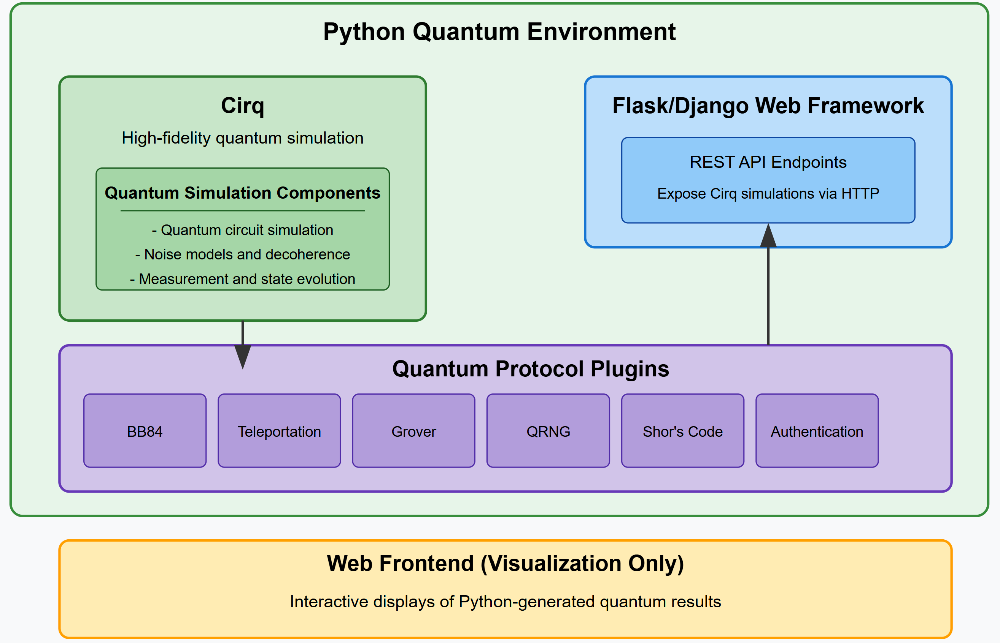

# Quantum Field Kit
# VISIT ME https://quantumfieldkit.com/
## CURRENTLY UNDERGOING A MAJOR CODEBASE OVERHAUL
#### The GUI model is difficult to maintain, lacks modularity and is restricted in its usability
#### The next release will inlcude a feature-rich web ui, more accurate and visual components, and a (more) modular code structure
#
#### Docker Containerization will also be used, I have been learning Docker in other projects (DIDentity) and look to transition projects towards containerized releases
#### As always, this project will remain open source, but will likely be publically hosted as well.
#

#
#
## Overview

Quantum Field Kit is a basic quantum computing simulation toolkit designed to demonstrate and explore various quantum protocols and concepts in a binary environment. 

This toolkit provides both a command-line interface (CLI) and a graphical user interface (GUI) for running quantum simulations to provide a conceptual demonstration of quantum protocols.


## Features

The Quantum Field Kit includes simulations of the following quantum protocols:

1. **BB84 Protocol**: A quantum key distribution simulation demonstrating secure communication.
2. **Quantum Handshake**: A simulation of quantum handshake using entangled pairs.
3. **Quantum Teleportation**: Simulates teleporting an unknown qubit state between two parties.
4. **Quantum Network**: Demonstrates entanglement swapping in a quantum communication network.
5. **Quantum Random Number Generator (QRNG)**: Generates random numbers using quantum measurement.
6. **Quantum Authentication**: Simulates quantum fingerprinting for authentication.


## Requirements

- Python 3.8+
- requirements.txt

## Installation

```bash
git clone https://github.com/Bobfrog93/quantum-field-kit
cd quantum-field-kit
pip install -r requirements.txt
```

## Usage

### Command-Line Interface

Run the CLI with various quantum protocol simulations:

```bash
python -m ui.cli bb84 --num 10
python -m ui.cli handshake
python -m ui.cli teleport
python -m ui.cli network
python -m ui.cli qrng --num 16
python -m ui.cli auth --data example_user
```

### Graphical User Interface

Launch the GUI:

```bash
python -m ui.gui
```

## Running Tests

```bash
python -m unittest tests.test_plugins
```

## Quantum Protocols Explained

#### BB84 Protocol (bb84.py)

- Demonstrates quantum key distribution using the uncertainty principle: measuring a qubit in the wrong basis destroys its information
- Shows how quantum superposition allows detection of eavesdropping, as any measurement disturbs the quantum state
- Illustrates how quantum mechanics enables unconditionally secure communication through the no-cloning theorem

#### Quantum Handshake (handshake.py)

- Explores quantum entanglement through Bell pairs, where two qubits share a special correlation regardless of distance
- Demonstrates Bell's theorem through measurements that show stronger correlations than possible with classical physics
- Shows how quantum measurement collapses superposition, ensuring the handshake can't be intercepted without detection

#### Quantum Teleportation (teleport.py)

- Demonstrates how quantum information can be transmitted using entanglement and classical communication
- Explores the concept of quantum state collapse through Bell measurements
- Shows how entanglement enables the perfect transfer of quantum information without violating the no-cloning theorem

#### Quantum Network (network.py)

- Illustrates entanglement swapping, where entanglement can be extended across a network without direct interaction
- Demonstrates the concept of quantum repeaters for long-distance quantum communication
- Shows how local quantum operations and classical communication can establish quantum connections between distant points

#### Quantum Random Number Generator (qrng.py)

- Demonstrates how quantum superposition can generate true randomness, unlike classical limitations
- Shows how quantum superposition states leads to unpredictable outcomes
- Illustrates the relationship between base choice and quantum randomness

#### Quantum Authentication (auth.py)

- Shows how quantum superposition can create unforgeable quantum signatures
- Demonstrates how the no-cloning theorem prevents copying of quantum authentication tokens
- Explores how quantum measurement disturbs quantum states, making tampering detectable

#### Grover's Algorithm (grover.py)

- Demonstrates quantum speedup through amplitude amplification in search problems
- Shows how quantum interference can be used to enhance desired solutions and suppress unwanted ones
- Illustrates how quantum parallelism allows searching through all possibilities simultaneously

#### Error Correction (shor_code.py)

- Demonstrates how quantum error correction protects quantum information
- Shows how quantum states can be resistant against both bit-flip and phase-flip errors
- Illustrates the concept of 'syndrome measurement' to detect errors without degrading the quantum state

#### Variational Quantum Eigensolver (vqe.py)

- Shows potential of quantum-classical hybrid algorithms to solve optimization problems
- Demonstrates the use of quantum observables to compute energy expectations
- Illustrates how quantum entanglement represents complex quantum states

##

## Installation
```bash
git clone https://github.com/ParleSec/quantum-field-kit
cd quantum-field-kit
pip install -r requirements.txt
```

##
## Graphical User Interface
Launch the GUI:
```bash
python gui.py
```

##
#### License
This project is licensed under the MIT License - see the [LICENSE](LICENSE) file for details.
