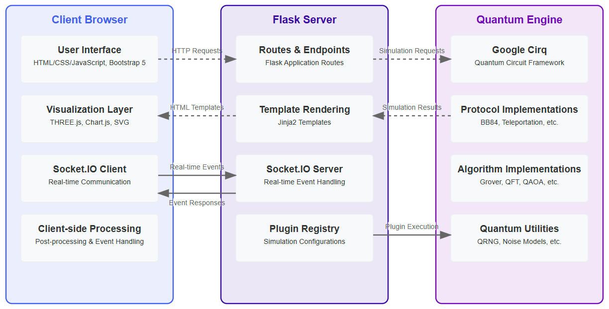

# Quantum Field Kit
     

##### Visit the live app: [quantumfieldkit.com](https://quantumfieldkit.com/)

## Project Overview

Quantum Field Kit is a web-based quantum computing simulation platform designed to bridge the gap between theoretical quantum mechanics and practical quantum computing education. The project aims to provide accessible visualizations and interactive demonstrations of quantum phenomena that are typically difficult to comprehend through traditional learning methods.

## Purpose & Motivation

### Why This Project Exists

The field of quantum computing is growing rapidly, but learning resources often fall into two categories:
1. Highly theoretical texts with complex mathematics
2. Oversimplified explanations that miss critical quantum concepts

Quantum Field Kit addresses this gap by providing:
- Visual, interactive representations of quantum states and operations
- Accurate simulations of quantum algorithms and protocols
- Educational content that connects theory to visual behavior
- A no-installation learning environment accessible via web browser

The project was created to democratize quantum computing education and provide both students and professionals with an intuitive understanding of quantum behavior through direct interaction and experimentation.

## Architecture

Quantum Field Kit follows a modern web application architecture with a focus on real-time interactivity and computational integrity.

### System Architecture Overview

### Component Breakdown

#### 1. Backend Architecture

- **Flask Application Layer**
  - Routes for simulation plugins
  - Parameter validation and security controls
  - Template rendering with Jinja2
  - Error handling and graceful degradation

- **Real-time Communication Layer**
  - Socket.IO for bidirectional communication
  - Progress updates during simulation execution
  - Streaming results for long-running simulations

- **Quantum Simulation Layer**
  - Google Cirq integration for quantum circuit simulation
  - Modular plugin system for different quantum algorithms
  - Advanced visualization data preparation
  - Optimized for web-appropriate computation limits

#### 2. Frontend Architecture

- **User Interface Layer**
  - Bootstrap 5 framework for responsive design
  - Form-based interaction model for simulation parameters
  - Tab-based result visualization
  - Educational content modals

- **Visualization Layer**
  - THREE.js for 3D quantum state visualization (Bloch sphere)
  - Chart.js for statistical results and distributions
  - SVG-based circuit diagram visualization
  - Custom visualization adapters for different quantum protocols

- **Client-side Processing**
  - JavaScript modules for post-processing simulation results
  - Dynamic content generation from simulation data
  - Browser-appropriate computation delegation

#### 3. Deployment Architecture

- **Containerization**
  - Docker for consistent runtime environment
  - Multi-stage build process for optimization
  - Environment-based configuration

- **Hosting**
  - Fly.io for global edge deployment
  - Automated deployment pipeline
  - Resource-constrained execution environment

### Data Flow

1. User configures simulation parameters through web interface
2. Parameters are validated and passed to the appropriate simulation plugin
3. Simulation runs on server using Google Cirq
4. Results streamed back to client via Socket.IO
5. Client-side processing transforms data into visualizations
6. Interactive visualization elements respond to user interaction

## Development Process & Technical Decisions

### Technology Selection Rationale

- **Flask**: Chosen for its lightweight nature and flexibility in designing API endpoints and serving web content
- **Google Cirq**: Selected as the quantum simulation library for its comprehensive gate implementations and support for noise models
- **Socket.IO**: Implemented to provide real-time feedback during computationally intensive simulations
- **THREE.js**: Used for 3D visualization of quantum states on the Bloch sphere, providing intuitive representation of qubit states
- **Bootstrap 5**: Selected for rapid UI development with responsive design principles
- **Docker + Fly.io**: Chosen for simplified deployment and scaling capabilities

### Development Workflow

The project was developed through several phases:

1. **Research & Planning**
   - Study of quantum algorithms and their visual representation needs
   - Identification of key educational quantum protocols
   - User experience mapping for quantum concept exploration

2. **Core Architecture Development**
   - Flask application setup with plugin architecture
   - Integration of Cirq simulation capabilities
   - Real-time communication layer implementation

3. **Quantum Simulation Implementation**
   - Protocol-by-protocol implementation of quantum simulations
   - Enhanced with realistic physics effects (noise, error, etc.)
   - Development of detailed logging for educational insights

4. **Visualization Layer Development**
   - Custom visualization components for quantum states
   - Circuit diagram rendering with interactive elements
   - Adaptive visualizations for different quantum phenomena

5. **Educational Content Creation**
   - Writing accessible explanations of quantum concepts
   - Creating analogies and simplified models for complex ideas
   - Structuring content to complement interactive elements

6. **Deployment & Optimization**
   - Containerization with Docker
   - Performance optimization for web environment
   - Security hardening and input validation

### Technical Challenges Overcome

- **Computation Balance**: Finding the right balance between simulation accuracy and web performance
- **Visualization Complexity**: Creating intuitive visualizations for non-intuitive quantum behavior
- **Cross-browser Compatibility**: Ensuring consistent 3D visualization across different browsers
- **Resource Constraints**: Optimizing simulations to work within memory and computation limits of web environments

## Key Features & Implementation Details

### Quantum Protocols Implementation

#### BB84 Protocol (Quantum Key Distribution)
- Implementation of realistic channel effects (noise, loss)
- Visual pipeline of the BB84 steps from qubit generation to secure key
- Eavesdropper simulation with detection probability

#### Quantum Teleportation
- Full circuit implementation with Bell state preparation
- Step-by-step visualization of the teleportation process
- Detailed mathematical explanation of quantum operations

#### Quantum Network (Entanglement Swapping)
- Multi-node quantum network simulation
- Visualization of entanglement distribution
- Correlation measurements across network nodes

### Quantum Algorithms Implementation

#### Grover's Algorithm
- Variable qubit implementation with adjustable search targets
- Amplitude visualization throughout the algorithm steps
- Performance comparison with classical search

#### Quantum Fourier Transform
- Interactive representation of quantum basis transformation
- Phase visualization before and after transformation
- Applications in other quantum algorithms explained

#### QAOA (Quantum Approximate Optimization Algorithm)
- Graph problem visualization
- Solution quality analysis
- Classical/quantum hybrid approach demonstration

### Core Visualization Components

#### Bloch Sphere Visualization
- Interactive 3D representation of qubit states
- Real-time state updates based on quantum operations
- Custom implementation using THREE.js with optimizations

#### Quantum Circuit Diagrams
- SVG-based circuit rendering
- Gate-by-gate visualization with educational tooltips
- Downloadable circuit diagrams for educational use

## Resources & Dependencies

### Core Libraries & Frameworks

#### Backend
- **Flask**: Web application framework
- **Werkzeug**: WSGI web application toolkit
- **Flask-SocketIO**: WebSocket communication
- **Eventlet**: Concurrent networking library
- **Gunicorn**: WSGI HTTP Server

#### Quantum Computing
- **Cirq**: Google's framework for creating, editing, and invoking Noisy Intermediate Scale Quantum (NISQ) circuits
- **NumPy**: Scientific computing package
- **SymPy**: Symbolic mathematics
- **NetworkX**: Network creation and analysis

#### Frontend
- **Bootstrap 5**: Front-end component library
- **Chart.js**: JavaScript charting library
- **THREE.js**: JavaScript 3D library
- **Socket.IO-client**: Real-time bidirectional communication

### Learning Resources

For those interested in quantum computing fundamentals that informed this project:

- **Quantum Computation and Quantum Information**: [Michael Nielsen & Isaac Chuang](https://archive.org/details/QuantumComputationAndQuantumInformation10thAnniversaryEdition/page/n461/mode/2up)
- **Google Cirq Documentation**: [https://quantumai.google/cirq](https://quantumai.google/cirq)
- **Qiskit Textbook**: [https://qiskit.org/textbook](https://qiskit.org/textbook)
- **Quantum Algorithm Zoo**: [https://quantumalgorithmzoo.org/](https://quantumalgorithmzoo.org/)

## Future Development

The project is continually evolving with planned enhancements:

- Additional quantum algorithms and protocols
- Enhanced visualization components for educational clarity
- Improved performance for larger quantum systems
- Advanced noise models for realistic quantum behavior
- API endpoints for external application integration

## License

This project is licensed under the MIT License - see the [LICENSE](LICENSE) file for details.

---

For questions, feedback, or support, please visit [issues](https://github.com/ParleSec/quantumfieldkit/issues)
